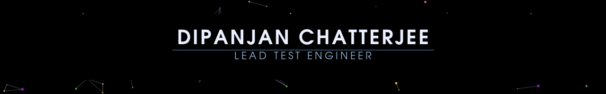

<!--
    Hey there, I'm Dipanjan!
    Happy to see you here exploring my README code
    Feel free to inspire!
-->

<!--
    Your own Terminal GIF can be created here -> https://www.terminalgif.com
-->
<!--
     This is the list of my skills and tools I am studying!
-->
### Tech Stack/Skillset

### Upskilling Currently

<!--
-->

### About Me  

Hi, I'm a QA Enginner turned into a Soultions Architect who is looking for some boost to launch myself into the cloud domain. Open to new challenges, technologies & change of seasons.

<!--
     Just Socializing
-->

### Connect with me! 

     &nbsp;
         &nbsp;
     

<!--
     Oh, hello there, recruiters!
-->

### Employ Me 

> <a href="https://drive.google.com/uc?export=download&id=1ADgGa5iBBfpbkDioKvVG5ArglMb7JaGB" download>Download my Resume</a>

 
 

<!--
     Thanks for being my guest <3
-->

